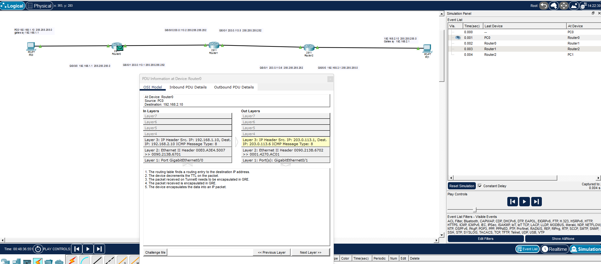
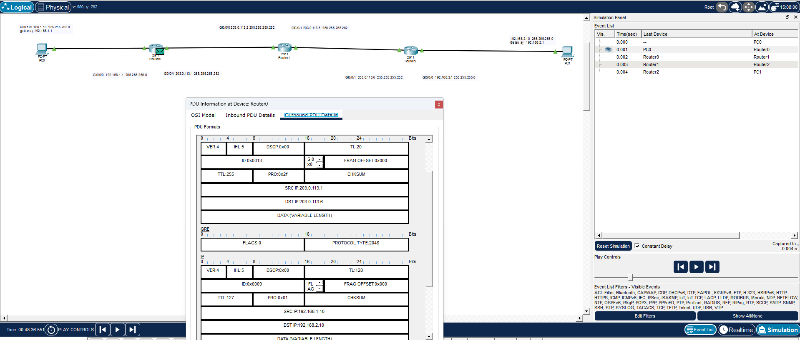
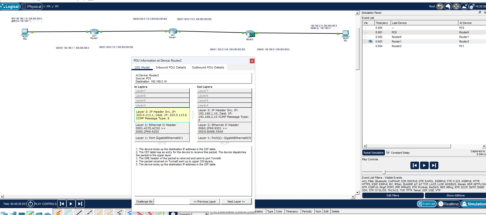
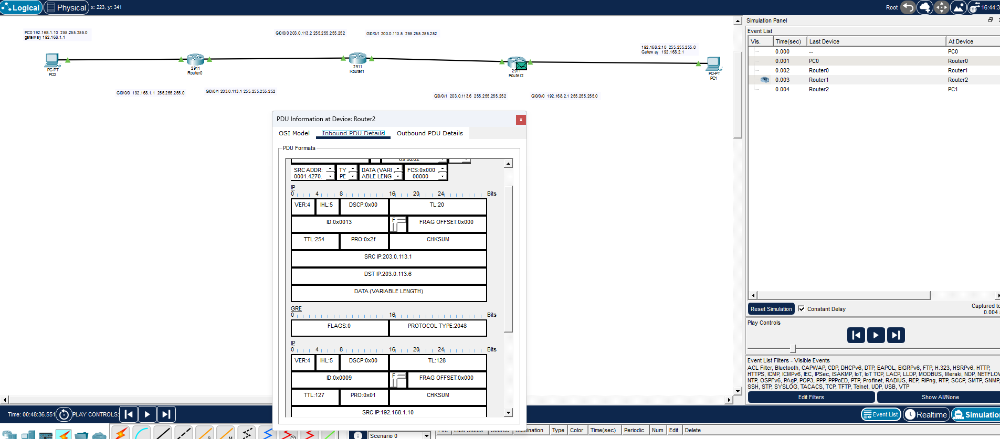

# GRE Tunnel Lab (Cisco Packet Tracer)

A hands-on lab configuring and verifying a point-to-point GRE tunnel between two remote sites, built as part of my CompTIA Network+ (N10-009) study — specifically the WAN/VPN concepts domain.

## Objective

The original goal was to build a DMVPN-style hub-and-spoke topology using multipoint GRE (mGRE) + NHRP, connecting a central hub to two branch spokes over a simulated internet transit router.

After building out the full topology and addressing every interface, `tunnel mode gre multipoint` returned an `Invalid input` error — the IOS version supported in Cisco Packet Tracer only implements standard point-to-point GRE (`tunnel mode gre ip`), not multipoint mode.

Rather than force an inaccurate workaround, I pivoted the lab to focus on GRE point-to-point, removed the hub, and rebuilt a simpler two-site topology.

## Topology

```
[PC0] --- [Spoke1] --- [Transit Router] --- [Spoke2] --- [PC2]
192.168.1.0/24                              192.168.2.0/24
```

| Device | Interface | IP Address | Connects to |
|---|---|---|---|
| PC0 | — | 192.168.1.10/24 | Spoke1 (LAN) |
| Spoke1 | Gi0/0 | 192.168.1.1/24 | PC0 |
| Spoke1 | Gi0/1 | 203.0.113.1/30 | Transit |
| Transit | Gi0/0 | 203.0.113.2/30 | Spoke1 |
| Transit | Gi0/1 | 203.0.113.5/30 | Spoke2 |
| Spoke2 | Gi0/1 | 203.0.113.6/30 | Transit |
| Spoke2 | Gi0/0 | 192.168.2.1/24 | PC2 |
| PC2 | — | 192.168.2.10/24 | Spoke2 (LAN) |
| Spoke1 | Tunnel0 | 172.16.0.1/30 | GRE tunnel |
| Spoke2 | Tunnel0 | 172.16.0.2/30 | GRE tunnel |

The transit router simulates an ISP/public network — Spoke1 and Spoke2 are not directly connected, only reachable through it.

## Configuration

**Spoke1**
```
interface GigabitEthernet0/0
 ip address 192.168.1.1 255.255.255.0
 no shutdown

interface GigabitEthernet0/1
 ip address 203.0.113.1 255.255.255.252
 no shutdown

ip route 203.0.113.4 255.255.255.252 203.0.113.2
ip route 192.168.2.0 255.255.255.0 172.16.0.2

interface Tunnel0
 ip address 172.16.0.1 255.255.255.252
 tunnel source GigabitEthernet0/1
 tunnel destination 203.0.113.6
 no shutdown
```

**Spoke2**
```
interface GigabitEthernet0/0
 ip address 192.168.2.1 255.255.255.0
 no shutdown

interface GigabitEthernet0/1
 ip address 203.0.113.6 255.255.255.252
 no shutdown

ip route 203.0.113.0 255.255.255.252 203.0.113.5
ip route 192.168.1.0 255.255.255.0 172.16.0.1

interface Tunnel0
 ip address 172.16.0.2 255.255.255.252
 tunnel source GigabitEthernet0/1
 tunnel destination 203.0.113.1
 no shutdown
```

**Transit Router** — standard interface addressing only, no tunnel configuration. It has no awareness of the GRE tunnel; it only routes plain IP traffic between the two `/30` links.

## Troubleshooting

Three real issues came up during this lab:

1. **`tunnel mode gre multipoint` not supported.** Packet Tracer's IOS only accepts `tunnel mode gre ip`. Confirmed via `tunnel mode gre ?`, which listed `ip` as the only option. This was the reason for pivoting away from mGRE/DMVPN.

2. **Tunnel stuck in `up, line protocol is down`.** The tunnel interface was administratively up but wouldn't establish. Root cause: each spoke had no route to the *other spoke's physical* `/30` network — only to the transit router's directly connected interface. A GRE tunnel's line protocol depends on having a valid underlay route to the `tunnel destination` IP; without it, the tunnel can't come up. Fixed by adding a static route to the remote physical subnet via the transit router.

3. **`ip route` rejected a Tunnel interface as next-hop.** Running `ip route <net> <mask> Tunnel0` returned `Invalid input detected`. Checking `ip route <net> <mask> ?` showed this IOS version only accepts an IP address or a physical interface type (Ethernet, Serial, etc.) as next-hop — not a Tunnel interface. Fixed by pointing the static route to the *tunnel IP* of the remote router instead (e.g., `ip route 192.168.2.0 255.255.255.0 172.16.0.2`).

## Verification

- `show interfaces tunnel0` on both routers confirmed `Tunnel0 is up, line protocol is up (connected)`.
- `ping 192.168.2.10` from PC0 to PC2 succeeded across the tunnel.
- Packet Tracer's Simulation mode confirmed the encapsulation process directly. The PDU Information window at Spoke1 showed the exact sequence:
  1. The routing table finds a routing entry to the destination IP address.
  2. The device decrements the TTL on the packet.
  3. The packet received on Tunnel0 needs to be encapsulated in GRE.
  4. The packet received is encapsulated in GRE.
  5. The device encapsulates the data into an IP packet.
- Comparing **In Layers** vs **Out Layers** at Spoke1 showed the encapsulation clearly:
  - In: `IP Header Src: 192.168.1.10, Dest: 192.168.2.10` (original ICMP packet)
  - Out: `IP Header Src: 203.0.113.1, Dest: 203.0.113.6` (GRE-encapsulated, carried over the physical underlay)
- The reverse process (de-encapsulation) was confirmed at Spoke2 as the packet exited the tunnel toward PC2.

### GRE Encapsulation (Spoke1 → outbound)




### GRE De-encapsulation (Spoke2 → inbound)




## Lessons Learned

- GRE and mGRE are stateless — there's no session teardown, which matters when reasoning about troubleshooting (there's no "connection" to reset, only interface/route state).
- A tunnel's line protocol depends entirely on underlay reachability to the tunnel destination — this is easy to overlook when focused on the tunnel's own configuration.
- Not all static route next-hop types are accepted equally across IOS versions; pointing to a remote IP is a more portable habit than pointing to a local interface name.
- Packet Tracer is a solid tool for point-to-point GRE, but its IOS does not support multipoint GRE (`tunnel mode gre multipoint`). Full mGRE + NHRP/DMVPN configuration will require GNS3 or Cisco Modeling Labs (CML) with unrestricted IOS images.

## Next Steps

- Build the full DMVPN lab (1 hub + 2 spokes, mGRE + NHRP) in GNS3 once IOS images are available through a licensed source.
- Capture the tunnel traffic in Wireshark to inspect the GRE header fields directly, alongside the passenger/carrier/transport protocol breakdown.
